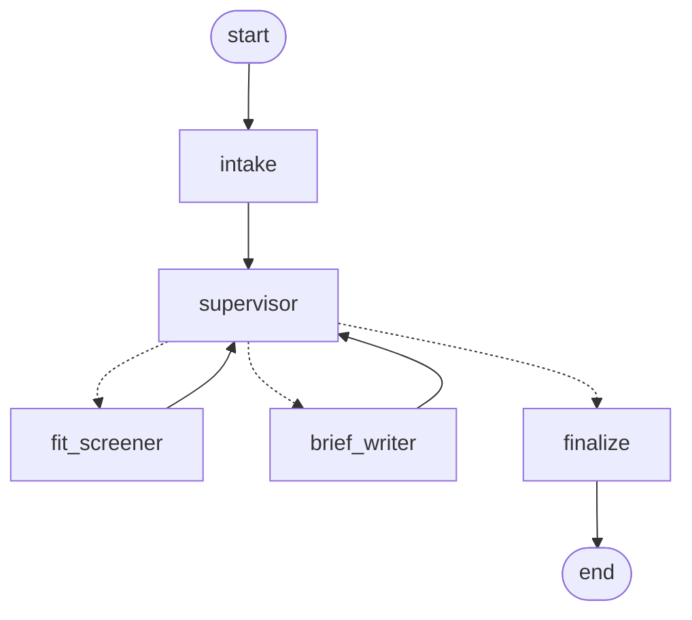

# job-fit-agents

A multi-agent pipeline that reads a job posting, measures how well it matches a
candidate profile, and drafts a role brief for a human to act on.

**It never submits an application.** That is the product's position, not a
temporary limitation — the disclaimer is a `Literal` on the output model, so it
cannot be edited away, and a test asserts that no prompt instructs the model to
apply on anyone's behalf.

```bash
uv sync
uv run python -m jobfit run --offline --posting examples/posting_sample.txt
```

That command needs no API key, no local model, and no internet. It is the same
command CI runs, so if it ever stops working this README is failing its build.

---

## What it does

Given a posting, four typed tools and two specialist agents produce something
like this (abridged real output):

```
# Backend Engineer (Python) - Remote

**Verdict:** worth applying
**Requirement coverage:** 71% (10 of 14) - measured deterministically,
                                           not estimated by the model

## Do NOT claim these in an interview
- Kubernetes
- infrastructure as code
```

That last section is the point of the whole project. The posting asks for
Kubernetes and for infrastructure as code; the profile lists both under
`never_claim`. The brief tells you what to steer away from saying out loud —
and it is filled in deterministically, so a model that forgets to mention it
cannot quietly drop it.

The percentage is computed in Python, not written by a model. **The number comes
from code; the language comes from the model**, and every trace entry records
which of the two produced it.

---

## Architecture



Generate the live version — from the graph that actually executes, so the
picture cannot drift from the code:

```bash
uv run python -m jobfit graph
```

| Node | Model? | What it does |
|---|---|---|
| `intake` | no | Resolves pasted text or a board search into postings |
| `supervisor` | yes | Decides who works next, and **why**. Routes ambiguous work back, and sends only promising postings to the expensive writer |
| `fit_screener` | yes | Reads a posting with tools, then emits a structured assessment |
| `brief_writer` | yes | Turns an assessment into the document a person reads. No network access |
| `finalize` | no | Closes the run with a named outcome |

Termination is a property of the graph, not of the model's cooperation: the
conditional edge forces `finalize` past a hard step ceiling even if the
supervisor insists on looping.

### The four tools

| Tool | Network | What it does |
|---|---|---|
| `search_job_boards` | yes | Greenhouse, Remotive, Arbeitnow. Returns summaries only — never bodies |
| `fetch_job_posting` | yes | One posting's full text, host-allowlisted |
| `parse_job_posting` | no | Unescapes entities, strips markup, keeps list structure, extracts requirements, clips to budget |
| `score_profile_match` | no | Deterministic requirement coverage. No model involved |

---

## Design decisions, including the ones I did not take

**The agent loop is written by hand.** The SDK ships
`client.beta.messages.tool_runner`, which would drive it for free. I did not use
it, for four reasons: the loop is the artefact being demonstrated, and hiding it
hides the evidence; the step ceiling, tool allowlist and per-step trace belong at
that level; the runner is beta; and the Python runner **does not resume
`pause_turn`** — a paused turn ends its loop and returns as the final message,
with no error and no warning, which is a silently truncated answer. `loop.py`
handles it explicitly and a test pins that.

**No LangChain chat model.** LangGraph orchestrates state and edges; the model is
reached through the official `anthropic` SDK directly. Going through
`ChatAnthropic` would make the API integration indirect and drag in a LangChain
version this project does not otherwise need.

**Why LangGraph at all**, when five nodes could be a `while` loop: conditional
edges plus per-field reducers (declared once instead of hand-merged at every
return), and `interrupt_before`, which makes human approval before the writer a
one-line change. `--approve` uses it today.

**No scraping.** Indeed and LinkedIn are absent because their terms forbid it,
because it breaks on every markup change, and because a public repository that
does it is visible to exactly the people it is meant to impress. The host
allowlist is code, not configuration, and refuses a forbidden host **before
opening a socket** — a test asserts zero requests were made, not merely that an
error came back.

**Attribution is structural.** Remotive's API response carries a legal notice
requiring a link back and asking for at most ~4 requests a day. A posting from an
API source cannot be constructed without its source URL — Pydantic rejects it —
and the disk cache with a TTL is how the request budget is honoured.

**Posting text is treated as hostile input.** It is third-party content fetched
over the network into the context of an agent that can call tools. The prompts
declare it as data, `tools/safety.py` defangs instruction-shaped spans, and what
was found is *reported* into the run trace rather than silently dropped. This is
not a solution to prompt injection and is not claimed as one — the real defences
are architectural: there is no tool that can submit an application, network tools
are allowlisted, tool arguments are schema-validated, and every run has a hard
step ceiling.

---

## Honest status

**What has actually run:** the full pipeline, against Qwen3 8B locally through
Ollama, and against the scripted offline transport. 287 tests, no API key, no
network.

**What has not:** a single request to the Anthropic API. `AnthropicTransport` is
implemented against SDK 1.x and covered by tests that pin the request shape
(adaptive thinking, no `budget_tokens`, `thinking.display: summarized`, streaming,
strict tool schemas, JSON-parsed tool inputs, retryable-vs-not error
classification) — but those tests use a stub client, and a stub is not proof of a
live integration. **This project has no API budget yet.** Switching is one
environment variable:

```bash
JOBFIT_TRANSPORT=anthropic JOBFIT_ANTHROPIC_API_KEY=sk-... uv run python -m jobfit run --posting examples/posting_sample.txt
```

I would rather say that plainly than imply an integration I have not exercised.

### Limitations

- **`score_profile_match` is token overlap, not comprehension.** It misses a
  requirement phrased in words the profile does not use. Real example from the
  test suite: a posting asking for "Terraform and infrastructure as code" matches
  the profile's `infrastructure as code` and misses `Terraform`, because the
  profile never says that word. The output is a measurement of overlap, and it is
  labelled as such rather than dressed up as understanding.
- **Seniority detection reads the title only, and abstains otherwise.** Reading
  the body was tried and removed: a real Remotive posting for a "Tier III Service
  Desk Engineer" was labelled `lead` twice over, once from the bullet "Lead and
  support our helpdesk environment" and once from the prose "You will serve as the
  escalation point". A wrong level feeds the deal-breaker check and would discard a
  viable role, so `None` — "the title does not say" — is the better answer.
- **A small local model routes worse than Claude.** The supervisor sometimes
  returns prose instead of JSON. There is a deterministic fallback so the run
  completes, and the trace records that the fallback decided.
- **Lever is not supported.** Its API works, but no public board with live
  postings could be found to verify the payload against — the slugs tried returned
  404 or an empty array. Writing an adapter against a schema nobody has seen is the
  unverified code this project exists to stop shipping.
- **No memory between runs, no eval set, no MCP server yet.** See below.
- **English-only prompts**, though the writer is told to answer in the language of
  the posting.

### Next, in order

1. One real Anthropic run, with the trace committed — closes the gap above.
2. Persistent memory via a LangGraph checkpointer. The state already holds only
   serialisable models, specifically so this is a new module and not a rewrite.
3. An eval set with a golden file, plus cost aggregation. `StepTrace` is emitted
   by every node already, so this is a sink and a report.
4. `interrupt_before` promoted into a real approval UX, plus a dry-run mode.
5. An MCP server exposing these same four tools. Tools are pure
   `(context, input_model) -> output_model` behind one `build_registry`, so this
   should be an adapter rather than a refactor.
6. Swap the Anthropic path to `client.messages.parse(output_format=...)` for
   server-enforced structured output. Today there is one shared JSON path for all
   transports, because the local model is what the demo runs on and a fallback the
   tests never exercise is a fallback that does not work.

---

## Usage

```bash
# offline, no key, no model, no network
uv run python -m jobfit run --offline --posting examples/posting_sample.txt

# with a free local model (install ollama, then: ollama pull qwen3:8b)
JOBFIT_TRANSPORT=ollama uv run python -m jobfit run --posting examples/posting_sample.txt

# search public job boards
uv run python -m jobfit run --search "python backend" --sources remotive --limit 3

# a Greenhouse board
uv run python -m jobfit run --search "engineer" --sources greenhouse --board arcoeducacao

# pause before the writer so a human reviews the assessment first
uv run python -m jobfit run --approve --posting examples/posting_sample.txt

# what is configured, and why it may not reach a model
uv run python -m jobfit doctor

# brief to stdout, run trace to stderr
uv run python -m jobfit run --offline --posting p.txt > brief.md 2> trace.jsonl
```

Use your own profile — the committed one is fictional:

```bash
cp configs/profile.example.toml configs/profile.toml   # gitignored
```

The `never_claim` list in a real profile is an honest inventory of your gaps,
which is why the real file stays local and only the fictional one is committed.

---

## Development

```bash
uv sync
uv run pytest -q              # 287 tests, no key, no network
uv run ruff check .
uv run ruff format .
```

The test suite guarantees two things about itself, and asserts both rather than
claiming them: every credential is stripped from the environment before any test
runs, and `httpx` is severed so a test reaching for the network fails by
construction instead of by luck. `tests/test_guards.py` proves the guards work.

Fixtures under `tests/fixtures/` are real payloads captured from the live APIs on
2026-09-08, entity-escaped markup and a 15,796-character description included.
Every bug in the parsing layer was found by that data rather than imagined —
including the one where 15 `<li>` requirements silently became zero.

**Stack:** Python 3.12, `anthropic` 1.4, `langgraph` 1.2, Pydantic 2.13, httpx,
pytest, ruff, uv. 5,200 lines of source, 3,200 of tests.

## Licence

MIT.
